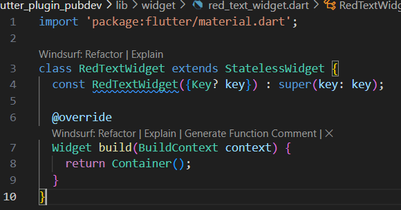
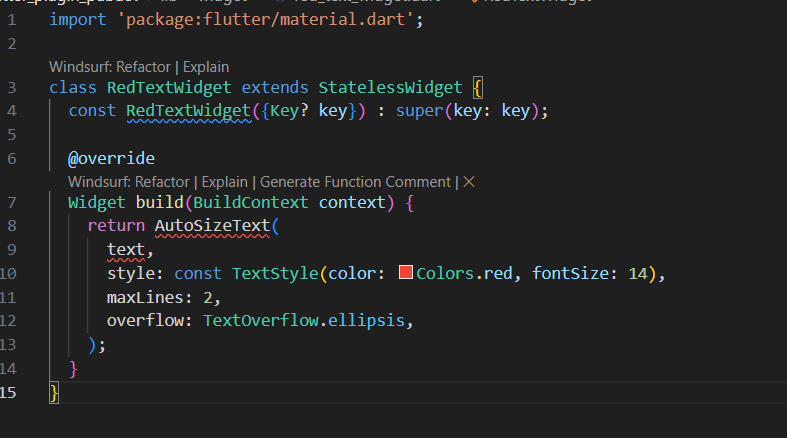
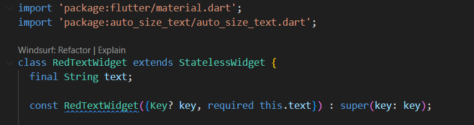
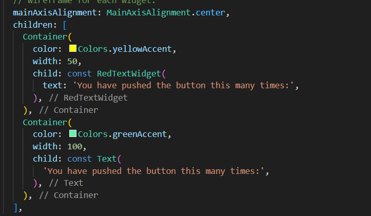
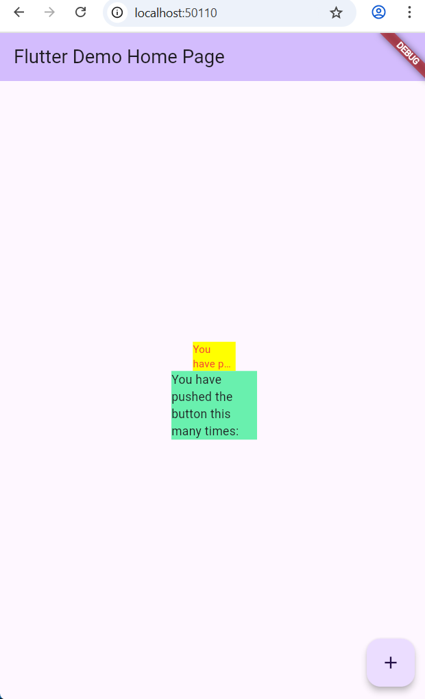

# Praktikum

## Langkah 1: Buat Project Baru

## Langkah 2: Menambahkan Plugin

## Langkah 3: Buat file red_text_widget.dart

## Langkah 4: Tambah Widget AutoSizeText

Terjadi error karena variabel text belum dideklarasikan, dan autosizetext belum dikenali karena package autosizetext belum diimport

## Langkah 5: Buat Variabel text dan parameter di constructor

## Langkah 6: Tambahkan widget di main.dart

# Tugas Praktikum

## 1. Jelaskan maksud dari langkah 2 pada praktikum tersebut!
    Langkah 2 dilakukan untuk menambahkan plugin auto_size_text ke dalam proyek Flutter menggunakan perintah flutter pub add auto_size_text. Plugin ini memungkinkan teks menyesuaikan ukuran font secara otomatis agar tetap pas di dalam area tampilan yang tersedia. Setelah perintah dijalankan, Flutter akan menambahkan dependensi plugin tersebut secara otomatis ke dalam file pubspec.yaml pada bagian dependencies. Dengan begitu, proyek Flutter dapat langsung memanfaatkan widget AutoSizeText untuk menampilkan teks yang responsif terhadap ukuran layar atau wadahnya.
## 2. Jelaskan maksud dari langkah 5 pada praktikum tersebut!
    Langkah 5 bertujuan untuk menambahkan properti text ke dalam kelas RedTextWidget dan menjadikannya sebagai parameter pada konstruktor. Properti ini berfungsi sebagai penampung nilai teks yang akan ditampilkan oleh widget. Dengan adanya parameter required this.text, setiap pemanggilan RedTextWidget harus menyertakan nilai teks yang ingin ditampilkan. Pendekatan ini membuat widget menjadi lebih dinamis dan reusable karena dapat menampilkan berbagai teks tanpa perlu memodifikasi kode internal widget.
## 3. Pada langkah 6 terdapat dua widget yang ditambahkan, jelaskan fungsi dan perbedaannya!
    Pada langkah 6, ditambahkan dua widget, yaitu RedTextWidget dan Text, yang sama-sama berfungsi untuk menampilkan teks pada antarmuka aplikasi. Perbedaannya terletak pada cara keduanya menangani ukuran teks. RedTextWidget memanfaatkan plugin AutoSizeText, sehingga ukuran font dapat menyesuaikan secara otomatis dengan ukuran Container. Jika teks terlalu panjang, widget ini dapat mengecilkan ukuran huruf atau menampilkan elipsis sesuai pengaturan overflow. Sementara itu, widget Text standar tidak memiliki kemampuan penyesuaian ukuran font otomatis, sehingga teks berpotensi terpotong jika ruang tampilan tidak mencukupi. Oleh karena itu, RedTextWidget lebih adaptif dan responsif dibandingkan widget Text biasa.
## 4. Jelaskan maksud dari tiap parameter yang ada di dalam plugin auto_size_text berdasarkan tautan pada dokumentasi ini!
    Widget AutoSizeText menyediakan beberapa parameter utama untuk mengatur tampilan teks. Parameter text berisi isi teks yang akan ditampilkan. Parameter style digunakan untuk mengatur tampilan visual teks, seperti warna, ukuran font, dan jenis huruf. Parameter maxLines berfungsi untuk membatasi jumlah baris maksimum yang dapat ditampilkan oleh teks. Selain itu, parameter overflow menentukan perilaku teks ketika tidak cukup ruang, misalnya dengan menampilkan tanda elipsis (TextOverflow.ellipsis). Kombinasi parameter-parameter ini memungkinkan teks ditampilkan secara fleksibel, rapi, dan tetap terbaca di berbagai kondisi ukuran layar.

